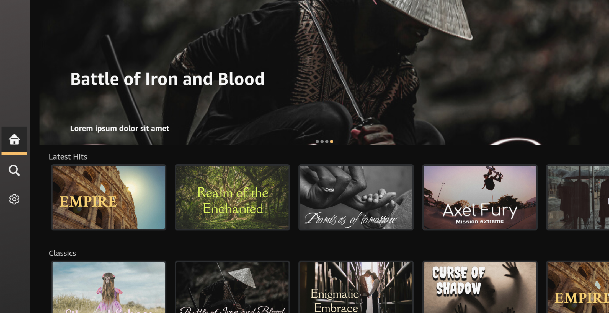

Vega Video Sample App
=======================

The Vega Video Sample App is a comprehensive sample implementation showcasing how to build a production-ready streaming video app for Amazon Vega OS Fire TV Stick using the Vega Developer Tools. The Vega Video Sample App is a learning resource and a foundation for you to create your own Vega OS Fire TV Stick video streaming experiences.



Introduction
------------

Built with React Native and TypeScript, the Vega Video Sample App demonstrates enterprise-grade video streaming capabilities including adaptive streaming protocols (HLS/DASH), DRM content protection, live TV integration, and seamless Vega OS Fire TV Stick platform integrations. Whether you're building a new streaming service or migrating an existing video platform to Vega OS Fire TV Stick, the Vega Video Sample App provides tested patterns and best practices for creating engaging and TV-optimized user experiences.

### Key features

- **Dynamic home interface** with rotating hero content and categorized video collections.
- **Detailed content pages** featuring metadata presentation and interactive controls.
- **Advanced video playback** using Shaka Player with support for adaptive streaming formats (HLS/DASH/DRM).
- **TV-optimized navigation** with focus management and remote control support.
- **In-App Purchasing integration** for content subscriptions and rentals.
- **Platform integrations** including Content Launcher, Linear TV, and Content Personalization.
- **Custom media controls** with accessibility features and subtitle management.


Build and run the app
--------------------

### Prerequisites

Before you launch the sample app, make sure that you have:

1. [Installed the Vega Developer Tools](https://developer.amazon.com/docs/vega/latest/install-vega-sdk.html)
2. **Java Runtime Environment (JRE) or Java Development Kit (JDK)** - Required by Shaka Player's build system for JavaScript compilation and optimization
3. **Python** - Required by Shaka Player's build scripts

**Note**: The Shaka Player integration runs automatically during `npm install` and requires these dependencies. If you encounter build errors related to Java or Python, install the missing prerequisites and run `npm install` again. For any other prerequisite Shaka issue please visit: https://shaka-project.github.io/shaka-player/docs/api/tutorial-welcome.html.


### Step 1: Build the app

After you download the source code from GitHub, you can build the Vega Video Sample App from the command line to generate VPKG files. The VPKG files run on the Vega Virtual Device and Vega OS Fire TV Stick.

You can also use [Vega Studio](https://developer.amazon.com/docs/vega/latest/setup-extension.html) with Visual Studio Code to build the app.

1. At the command prompt, navigate to the Vega Video Sample App source code directory. 

2. To install the app dependencies, run the following command. 

   ```
   npm install
   ```

3. To build the app to generate .vpkg files, run the following command.

   ```
   npm run build:app
   ```

4. At the command prompt, in the **build** folder, verify that you generated the VPKG files for your device's architecture.

   * **armv7-release/keplervideoapp_armv7.vpkg**&mdash;generated on x86_64 and Mac-M series devices to run on the Vega OS Fire TV Stick.
   * **x86_64-release/keplervideoapp_x86_64.vpkg**&mdash;generated on x86_64 device to run on the VVD.
   * **aarch64-release/keplervideoapp_aarch64.vpkg**&mdash;generated on Mac M-series device to run on the VVD.
   
### Step 2: Run the app

#### Vega Virtual Device

1. To start the Vega Virtual Device, at the command prompt, run the following command.

   ```
   vega virtual-device start
   ```

2. Go to the directory where you placed the VPKG files. 

3. To install and launch the app on the Vega Virtual Device, run the following command, depending on your device architecture.

   - On Mac M-series based devices. 
      
      ```
      vega run-app build/aarch64-release/keplervideoapp_aarch64.vpkg
      ```

   - On x86_64 based devices.
      
     ```
     vega run-app build/x86_64-release/keplervideoapp_x86_64.vpkg
     ```  

#### Vega OS Fire TV Stick

1. Turn on your Vega OS Fire TV Stick.

2. To install and launch the app on your Vega OS Fire TV Stick, run the following command.

   ```
   vega run-app build/armv7-release/keplervideoapp_armv7.vpkg
   ```


Advanced features
-----------------

### Upload custom search data for your app

You can upload a sample JSON file to a specified location and search the data from the uploaded file. If you upload the file, the search only uses the data from the file. If you do not upload the file, the search uses the existing data from the Home screen video tiles.

1. Create a JSON file with search data based on the following structure. 

   File name: **KVATestData.json**

   Path: **/home/app_user/packages/com.amazondeveloper.keplervideoapp/data**

   **JSON structure**   
     
   ```json
   [
     {
       "medias": [
         {
           "uri": "string",
           "categories": ["string"],
           "channelID": "string",
           "posterUrl": "string",
           "format": "string",
           "drm_scheme": "string (optional)",
           "drm_license_uri": "string (optional)",
           "textTrack": "TextTrack[] (optional)",
           "uhd": "boolean",
           "secure": "boolean",
           "acodec": "string (optional)",
           "vcodec": "string (optional)",
           "rentAmount": "string"
         }
       ],
       "playlistName": "string"
     }
   ]
   ```

   
   **Example search JSON file**   
    
   ```json
   [
     {
       "playlistName": "Test file ",
       "medias": [
         {
           "id": "13342393",
           "title": "Sample file",
           "description": "Hey Everyone, travel a little south of Uvita and across from Playa Ocochal (Ojochal), and then take a left at the sign advertising the Tilapa El Pavon Restaurant. On the way to the restaurant (which we have a video about and also recommend), on the left hand side, you should see the sign for La Cascada el Pavon (Turkey Waterfall). We highly suggest you stop and take the very short hike down to the waterfall and check it out. Way COOL! Don't take our word for it - Check out this video. Pura Vida!",
           "duration": 105,
           "thumbnail": "http://le1.cdn01.net/videos/0000133/0133420/thumbs/0133420__005f.jpg",
           "posterUrl": "http://le1.cdn01.net/videos/0000133/0133420/thumbs/0133420__005f.jpg",
           "videoUrl": "https://edge-vod-media.cdn01.net/encoded/0000133/0133420/video_1880k/G0CXIG1LX.mp4?source=firetv&channelID=13454",
           "categories": ["Costa Rica Islands"],
           "channelID": "13454",
           "rating": "2.5",
           "mediaType": "video",
           "mediaSourceType": "url",
           "format": "MP4",
           "secure": false,
           "uhd": true,
           "rentAmount": "135"
         },
       ]
     }
   ]
   ```

2. Push the JSON search file to the device using the following command.  

   ```
   vega exec vda push KVATestData.json /home/app_user/packages/com.amazondeveloper.keplervideoapp/data
   ```

 
### Splash screen

For comprehensive implementation guidance, please refer to the detailed [Splash Screen Manager](https://developer.amazon.com/docs/react-native-vega/0.72/splashscreenmanager.html) document. This document covers API usage, lifecycle management, asset optimization, and platform-specific considerations for creating engaging splash screen experiences on Vega OS Fire TV Stick.

#### Splash screen assets structure

```
assets/raw/SplashScreenImages.zip
├── _loop/
│   ├── loop00000.png
│   ├── loop00001.png
│   ├── loop00002.png
│   ├── loop00003.png
│   ├── loop00004.png
│   └── loop00005.png
└── desc.txt
```

The `SplashScreenImages.zip` contains images from the `SplashScreenImages` folder. Individual assets are available in `assets/raw/SplashScreenImages/` for reference. Only the ZIP file is required for implementation.

App integrations
----------------

### W3C Media APIs

The Vega Video Sample App uses Vega's W3C Media API (`@amazon-devices/react-native-w3cmedia`) for video playback and demonstrates some of its features:

- [Adaptive Streaming Playback](#adaptive-streaming-playback)
- [Pre-buffering](#pre-buffering)
- [Custom UI](#custom-ui)

**Comprehensive W3C Media API documentation**

- [W3C Media API in React Native for Vega](https://developer.amazon.com/docs/vega/latest/media-player.html) - Complete API reference and concepts.
- [Media Player Setup](https://developer.amazon.com/docs/vega/latest/media-player-setup.html) - Step-by-step implementation instructions.

#### Adaptive streaming playback

Adaptive streaming playback is a core feature of the W3C Media API. You can try out these different file types by using [VideoFileType.tsx](src/components/VideoFileType.tsx) found on the [Details screen](src/screens/DetailsScreen.tsx).

To use the W3C Media API for adaptive streaming, you need a separate Media Source Extension (MSE) player. In the Video Sample app, the [Shaka Player](#shaka-player) is used.

**Detailed implementation guides**

To use the W3C Media API for adaptive streaming, you need a separate Media Source Extension (MSE) player. In the Video Sample app, the [Shaka Player](#shaka-player) is used.

**Detailed implementation guides**

- [Play adaptive content using Dash.js Player](https://developer.amazon.com/docs/vega/latest/media-player-dash-player.html) - Complete guide for MPEG DASH streaming.
- [Play adaptive content using Hls.js Player](https://developer.amazon.com/docs/vega/latest/media-player-hls-player.html) - Complete guide for HTTP Live Streaming.

#### Pre-buffering

Pre-buffering allows video content to be loaded outside of the player component. In the Video Sample App, pre-buffering begins on the [Details screen](src/screens/DetailsScreen.tsx#L45). This allows the video to start loading before the user reaches the [Player screen](src/screens/PlayerScreen.tsx). This greatly decreases how long the user has to wait for the video to start. The utility class [VideoHandler.ts](src/utils/VideoHandler.ts) handles pre-buffering and its clean-up functions.

#### Custom UI

The W3C Media API allows you to hide the standard UI and display your own UI on top of the video player. In the Video Sample App, a [custom UI](src/w3cmedia/mediacontrols/VideoPlayerUI.tsx) was created to demonstrate this. The buttons of this custom UI connect to the `VideoPlayer` object and trigger the appropriate actions.

#### Shaka Player

Shaka Player is a JavaScript (JS) player created for adaptive streaming on the web. The architecture of the W3C Media API allows this web player to also be used in Vega apps. A port of the Shaka player's code is included in [`src/w3cmedia/shakaplayer`](src/w3cmedia/shakaplayer). A helper function [ShakaPlayer.ts](src/w3cmedia/shakaplayer/ShakaPlayer.ts) was created to instantiate the Shaka player class and link it to the W3C Media API.

**For implementing the Shaka Player in your own projects**, we recommend following the comprehensive [Play adaptive content (HLS/DASH) with Shaka Player](https://developer.amazon.com/docs/vega/latest/media-player-shaka-player.html) document. This document provides detailed implementation instructions, best practices, and troubleshooting tips specific to the Vega platform.

### In-App Purchasing

The In-App Purchasing (IAP) API allows apps to present, process, and fulfill purchases of digital content and subscriptions within the app. The Video Sample App demonstrates a simple use-case of the IAP APIs through the "Purchase Subscription" button on the Details Screen.

#### Set up IAP

Prior set up is needed to utilize the IAP APIs and handle transactions properly. This set up is required every time the VVD or device is launched. Please follow the [IAP documentation](https://developer.amazon.com/docs/vega/latest/vega-iap-overview.html) to onboard and set up the [IAP Tester App](https://developer.amazon.com/docs/vega/latest/configure-app-tester.html). You can reference the IAP documentation and follow the formats to properly configure the IAP environment.

### Content Launcher integration

To implement Content launcher, see the [Content Launcher Overview](https://developer.amazon.com/docs/vega/latest/content-launcher-overview.html) documentation.

### Content Personalization

To learn more, see [Get Started with Vega Content Personalization](https://developer.amazon.com/docs/vega/latest/get-started-with-vega-content-personalization.html).


### Linear TV

To learn more, see [Get Started with Linear TV](https://developer.amazon.com/docs/vega/latest/get-started-with-linear-tv.html).


### Focus management

Focus management is critical for TV apps as users navigate using remote controls rather than touch input. The Vega Video Sample App implements a comprehensive focus management system to ensure intuitive navigation.

#### How to provide initial focus

Initial focus can be specified by your app using the `hasTVPreferredFocus` props. This is essential because TV users need a clear starting point when entering a screen.

Example:

```javascript
<ImageBackground style={styles.imageBackgroundContainer}>
  {/* BackButton is a wrapper component over primitive React Native component */}
  <BackButton
    overrideStyle={styles.backButton}
    hasTVPreferredFocus={true}
    onPress={navigateBack}
  />
  <View style={styles.content}>
    <Text style={styles.titleText} numberOfLines={1}>
      {route.params.data.title}
    </Text>
  </View>
</ImageBackground>
```

**Why this pattern is used**

- **TV navigation requirements**: Unlike mobile apps, TV apps require explicit focus management because users can't tap directly on elements.
- **User experience**: Setting initial focus prevents users from having to navigate blindly to find the first interactive element.
- **Accessibility**: Ensures screen readers and other assistive technologies have a clear starting point.
- **Platform consistency**: Follows Vega OS Fire TV Stick platform guidelines for focus behavior.


#### FocusableElement component pattern

The Video Sample App uses a custom `FocusableElement` component that wraps `TouchableOpacity` to provide consistent focus behavior.

Example: 

```javascript
const FocusableElement = ({
  hasTVPreferredFocus,
  onFocusOverrideStyle,
  style,
  onFocus,
  onBlur,
  ...otherProps
}) => {
  const [isFocused, setIsFocused] = useState(false);

  return (
    <TouchableOpacity
      hasTVPreferredFocus={hasTVPreferredFocus}
      style={[style, isFocused ? onFocusOverrideStyle : undefined]}
      onFocus={() => setIsFocused(true)}
      onBlur={() => setIsFocused(false)}
      {...otherProps}
    />
  );
};
```

**Implementation rationale**

- **Visual feedback**: Provides clear visual indication when elements are focused.
- **Consistent styling**: Ensures all focusable elements follow the same focus styling patterns.
- **State management**: Tracks focus state for conditional rendering and styling.
- **Reusability**: Single component handles focus logic across the entire app.

### Platform-specific implementations

The Video Sample App uses `Platform.isTV` checks throughout the codebase to provide optimized experiences for different device types.

#### Feature availability based on platform

```javascript
// AppConfig.ts - Feature flags based on platform capabilities
const isContentPersonalizationEnabled = () => {
  return !isSimulator && Platform.isTV;
};

const isInAppPurchaseEnabled = () => {
  return Platform.isTV;
};

const isAccountLoginEnabled = () => {
  return Platform.isTV;
};
```

**Why platform-specific feature flags are used**

- **Hardware limitations**: Some features like IAP are only available on actual TV devices.
- **VVD constraints**: Content Personalization requires real device capabilities not available in VVD.
- **Performance optimization**: Prevents unnecessary service initialization on unsupported platforms.
- **Development efficiency**: Allows testing core functionality even when platform services aren't available.

#### Adaptive video resolution

Example:

```javascript
// VideoHandler.ts - Resolution optimization based on device capabilities
const DEFAULT_ABR_WIDTH: number = Platform.isTV ? 3840 : 1919;
const DEFAULT_ABR_HEIGHT: number = Platform.isTV ? 2160 : 1079;
```

**Implementation reasoning**

- **TV optimization**: TV devices can handle 4K (3840x2160) resolution for optimal viewing experience.
- **Resource management**: Non-TV devices use lower resolution to conserve bandwidth and processing power.
- **Adaptive bitrate**: Ensures smooth playback across different device capabilities.

#### Navigation behavior differences

Example:

```javascript
// MovieGrid.tsx - Different scroll behavior for TV vs mobile
<ScrollView
  horizontal={!Platform.isTV}
  scrollEnabled={!Platform.isTV}
  showsHorizontalScrollIndicator={false}
>
```

**Why different navigation patterns**

- **TV interface design**: TV interfaces typically use vertical navigation to match remote control D-pad behavior.
- **Mobile optimization**: Mobile devices benefit from horizontal scrolling for content discovery.
- **User expectations**: Each platform has established UX patterns that users expect.

### Splash screen management

The Video Sample App implements sophisticated splash screen management to ensure smooth app startup across different environments.

#### Development vs production behavior

Example:

```javascript
// App.tsx - Conditional splash screen handling
const App = () => {
  const isTv = Platform.isTV;
  const preventHideSplashScreen = usePreventHideSplashScreen;
  const hideSplashScreen = useHideSplashScreenCallback();

  if (isTv) {
    preventHideSplashScreen();
  }

  if (__DEV__) {
    hideSplashScreen();
  }
};
```

**Implementation rationale**

- **TV launch requirements**: TV apps must prevent splash screen from hiding until app is fully ready.
- **Development efficiency**: Debug builds hide splash screen immediately to speed up development iteration.
- **User experience**: Production builds show splash screen until content is loaded and ready for interaction.
- **Platform compliance**: Meets Vega OS Fire TV Stick platform requirements for app launch behavior.

### Error handling strategy

The Video Sample App implements a centralized error handling approach with user-friendly error displays.

#### ErrorView component pattern

Example:

```javascript
// ErrorView.tsx - Consistent error display across the app
const ErrorView = ({navigateBack}) => {
  return (
    <View style={styles.mainContainer}>
      <Header navigateBack={navigateBack} />
      <View style={styles.errorContainer}>
        <Typography variant={'title'} color={COLORS.WHITE}>
          {ErrorMsg}
        </Typography>
      </View>
    </View>
  );
};
```

**Why this error handling approach**

- **User experience**: Provides clear, actionable error messages instead of app crashes.
- **Navigation consistency**: Maintains header with back button so users can always return.
- **Visual consistency**: Uses the design system of the app for error states.
- **Graceful degradation**: Allows the app to continue functioning even when specific features fail.


Integrate 3P libraries into the app
-----------------------------------

This section provides the minimum integration steps necessary to integrate the third-party libraries with the sample app.

### react-native-svg

**To integrate this library**

1. In your **package.json** file, add the following package dependency.   

   ```json
   "dependencies": {
      ...
      "@amazon-devices/react-native-svg": "~2.0.0"
   }
   ``` 
  
    
2. To reinstall the dependencies, run the `npm install` command.

    **Note**:This app uses the React component generated from the [SVGR](https://react-svgr.com/playground/) tool with some minor modification with respect to the imports. For details, see the `HomeSVG.tsx` file.


3. Import the corresponding SVG component.

   ```
   import HomeSvg from '../../assets/svgr/HomeSVG';
   ```

    

4. In the render block of your app, add the imported component.   
    
   ```
   <HomeSvg
        width={40}
        height={40}
        stroke={'#F1F1F1'}
        fill={'#F1F1F1'}
      />
   ``` 

   

For more details about this Vega supported library, see [react-native-svg](https://developer.amazon.com/docs/vega-api/latest/react-native-svg.html).


### react-native-vector-icons

**To integrate this library**

1. In your **package.json** file, add the following package dependency. 
    
   ```json
   "dependencies": {
      ...
      "@amazon-devices/react-native-vector-icons": "~2.0.0"
   }
   ```

2. Reinstall the dependencies using `npm install`.

3. Add your font files to `<app_package_root>/assets/fonts`.

4. Import the corresponding `MaterialIcons` component.

   ```
   import MaterialIcons from '@amazon-devices/react-native-vector-icons/MaterialIcons';
   ```   

5. In the render block of your app, add the `MaterialIcons` component.

   ```typescript
   <MaterialIcons name={'play'} size={50} color={#ffffff} />;
   ```
       

For more details about this Vega supported library, see [react-native-vector-icons](https://developer.amazon.com/docs/vega-api/latest/react-native-vector-icons.html) in the Vega documentation.


### lottie-react-native

**To integrate this library**

1. In your **package.json** file, add the following dependency. 

   ```json
   "dependencies": {
      ...
      "@amazon-devices/lottie-react-native": "~2.0.0"
   }
   ```      

2. To reinstall the dependencies, run the `npm install` command.

3. In `<app_package_root>/src/js/resources/`, add your Lottie animation.

4. In `<app_package_root>/assets/image/`, add your Lottie animation.

    **Note**: On Vega, you can place alternatively place Lottie animations (not its image assets) in `<app_package_root>/assets/raw/`. Other than a small difference in path, this is similar to the behavior on Android.

5. To import the corresponding `LottieView` component, run the following command.
    
   ```
   import LottieView from "@amazon-devices/lottie-react-native";
   ```

6. In the render block of your app, add the `LottieView` component.

   ```typescript
   <LottieView source={require("../path/to/animation.json")} autoPlay loop />
   ```
    

For more details about this Vega supported library, see [lottie-react-native](https://developer.amazon.com/docs/vega-api/latest/lottie-react-native.html).


### react-native-navigation

 **WARNING**: Due to a recent dependency update in React Navigation, you are now required to add `"@amazon-devices/react-native-screens": "~2.0.0"` as a dependency for any package that uses React Navigation. If you don’t add the dependency, the app crashes.


**To integrate this library**

1. In your **package.json** file, add the subset of VegaUIReact-Navigation dependencies that are needed to support your app.
    
   ```json
   "dependencies": {
      ...
      "@amazon-devices/react-native-safe-area-context": "~2.0.0",
      "@amazon-devices/react-navigation__routers": "~7.0.0",
      "@amazon-devices/react-navigation__core": "~7.0.0",
      "@amazon-devices/react-navigation__native": "~7.0.0",
      "@amazon-devices/react-navigation__stack": "~7.0.0",
      "@amazon-devices/react-navigation__drawer": "~7.0.0",
      "@amazon-devices/react-native-screens": "~2.0.0",
   }
   ```


   **Note**: The subpackage `react-navigation/native-stack` is not supported on the Vega platform.

   While the Vega platform does have a fork of React Native Reanimated, React Native Safe Area Context, and React Native Screens, they are not officially supported on the Vega platform. @amazon-devices/keplerscript-react-native-reanimated, @amazon-devices/keplerscript-react-native-safe-area-context and @amazon-devices/react-native-screens were created to rectify build issues found when supporting @amazon-devices/keplerscript-react-navigation-* packages.

2. In your project's **package.json** file, install the required peer dependencies. 

   ```json
   "devDependencies": {
      ...
      "react-native-gesture-handler": "~2.13.0",
   }
   ```
   
3. Within the `NavigationContainer` component, wrap your returned app code. Typically, you do this in your entry file, such as **index.js** or **App.js**.

   1. Import the following libraries.      

      ```typescript
      import 'react-native-gesture-handler';
      import * as React from 'react';
      import { NavigationContainer } from '@amazon-devices/react-navigation__native';
      ```
       
   2. In the render block, add the `NavigationContainer` component.    

      ```typescript
      export default App = () => {
        return (
          <NavigationContainer>
            {/* Rest of your app code */}
          </NavigationContainer>
        );
      };
      ```
   
For more details about this Vega supported library, see [react-native-navigation](https://developer.amazon.com/docs/react-native-vega/0.72/keplerscript_nav.html).

### react-linear-gradient

**To integrate this library**

1. In your **package.json** file, add the following package dependency.
    
   ```json
   "dependencies": {
      ...
      "@amazon-devices/react-linear-gradient": "~2.0.0"
   }
   ```
   
2. To reinstall the dependencies, run the `npm install` command.

3. Import the corresponding `LinearGradient` component.
    
   ```typescript
   import LinearGradient from '@amazon-devices/react-linear-gradient';
   ```   

4. In the render block of your app, add the imported component.

   ```typescript
   <LinearGradient
     colors={['#4c669f', '#3b5998', '#192f6a']}
     style={styles.linearGradient}>
     <Text style={styles.buttonText}>Here Is My Text</Text>
   </LinearGradient>;
   ```
     

For more details about this Vega supported library, see [react-linear-gradient](https://developer.amazon.com/docs/vega-api/latest/react-linear-gradient.html).

### react-native-netinfo

**To integrate this library**

1. In your **package.json** file, add the following package dependency. 
    
   ```json
   "dependencies": {
      ...
      "@amazon-devices/keplerscript-netmgr-lib": "~2.0.2",
   }
   ```
   
2. In your React Native for Vega app's **manifest.toml**, add `com.amazon.network.service` to `wants.service`.
    
   ```text
   [[wants.service]]
   id = "com.amazon.network.service"
   ```
   
3. In your React Native for Vega app's **manifest.toml**, add API permission to `needs.privilege`. 
   
   ```text
   [needs]
   [[needs.privilege]]
   id="com.amazon.network.privilege.net-info"
   ```
   
4. To reinstall the dependencies, run the `npm install` command.

5. Import the corresponding `NetInfo` component.
    
   ```typescript
   import {NetInfoStateType, fetch} from "@amazon-devices/keplerscript-netmgr-lib";
   ```

6. To get the network status, use the fetch method.

   ```typescript
   fetch().then(state => {
       console.log("is connected? " + state.isConnected);
       if (state.type === NetInfoStateType.wifi) {
         console.log("ssid is " + state.details.ssid);
       }
   });
   ```

For more details about this Vega supported library, see [react-native-netinfo](https://developer.amazon.com/docs/vega-api/latest/react-native-net-info.html).


### react-native-device-info

**To integrate this library**

1. In your **package.json** file, add the following package dependency. 

   ```json
   "dependencies": {
      ...
      "@amazon-devices/react-native-device-info": "~2.0.0"
   }
   ```   

2. To reinstall the dependencies, run the `npm install` command.

3. Usage.
    
   ```typescript
   import DeviceInfo from '@amazon-devices/react-native-device-info';

   // or ES6+ destructured imports

   import { getBaseOs } from '@amazon-devices/react-native-device-info';
   ```
     

#### API
Most of the functions return a Promise, but also have a corresponding function with Sync on the end that operates synchronously. For example, you might prefer to call `getBaseOsSync()` when your app initializes the operating system (OS) to avoid async calls during the first parts of the app startup.

**Note**: Values used in examples don't represent the actual output.

#### getBaseOs()
The base OS build that the device is based on.

The following example shows how to call `getBaseOsSync()` to return the base OS build.
    
 ```typescript
DeviceInfo.getBaseOs().then((baseOs) => {
  // "Vega"
});
```

For more details about this Vega supported library, see [react-native-device-info](https://developer.amazon.com/docs/vega-api/latest/react-native-device-info.html).

### reduxjs toolkit

The Redux Toolkit (RTK) is a library to help you code Redux apps. The `@reduxjs/toolkit` package wraps around the core Redux package, and contains API methods and common dependencies that are essential for you to build a Redux app. The toolkit implements best practices, simplifies most Redux tasks, and prevents common mistakes.

**To integrate this library**

1. In your **package.json** file, add the following package dependencies. 
    
   ```json
   "dependencies": {
      ...
      "@reduxjs/toolkit": "2.2.4",
      "react-redux": "9.1.2",
   }
   ```

2. To reinstall the dependencies, run the `npm install` command.

3. In the `features/counter/counterSlice.ts` file, define slice state and action types.

   1. Import `createSlice`, `PayloadAction`, `RootState`.

      ```typescript
      import { createSlice } from '@reduxjs/toolkit';
      import type { PayloadAction } from '@reduxjs/toolkit';
      import type { RootState } from '../../app/store';
      ```
    
   2. Usage.
    
      ```typescript
      // Define a type for the slice state.
      interface CounterState {
        value: number;
      }

      // Define the initial state using that type.
      const initialState: CounterState = {
        value: 0,
      };

      export const counterSlice = createSlice({
        name: 'counter',
        // `createSlice` infers the state type from the `initialState` argument.
        initialState,
        reducers: {
          increment: (state) => {
            state.value += 1;
          },
          decrement: (state) => {
            state.value -= 1;
          },
          // Use the PayloadAction type to declare the contents of `action.payload`.
          incrementByAmount: (state, action: PayloadAction<number>) => {
            state.value += action.payload;
          },
        },
      });

      export const { increment, decrement, incrementByAmount } = counterSlice.actions;

      // Other code such as selectors can use the imported `RootState` type.
      export const selectCount = (state: RootState) => state.counter.value;

      export default counterSlice.reducer;
      ```   
 
4. In the **app/store.ts** file, define root state and dispatch types.

   1. Import `configureStore`.
    
      ```typescript
      import {configureStore} from '@reduxjs/toolkit';
      import counterReducer from './features/counter/counterSlice';
      ```
       
   2. Usage.  
    
      ```typescript
      export const store = configureStore({
           reducer: {
                counter: counterReducer,
           },
      });

      // Infer the `RootState` and `AppDispatch` types from the store itself.
      export type RootState = ReturnType<typeof store.getState>;
      // Inferred type: {posts: PostsState, comments: CommentsState, users: UsersState}.
      export type AppDispatch = typeof store.dispatch;
      ```

For more details about this library, see the [Redux Toolkit overview](https://redux-toolkit.js.org/tutorials/overview).

### lodash

**To integrate this library**

1. In your **package.json** file, add the following package dependency. 

   ```json
   "dependencies": {
      ...
      "lodash": "^4.17.21",
   }
   ```

2. To reinstall the dependencies, run the `npm install` command.

3. Import the corresponding `isEqual` method.
    
   ```typescript
   import {isEqual} from 'lodash';
   ``` 

4. The `isEqual` function performs a deep comparison between two values to determine if they are equivalent.

   ```typescript
   Example;

   const obj1 = {a: 1, b: {c: 2}};
   const obj2 = {a: 1, b: {c: 2}};

   // Comparing two objects.
   console.log(isEqual(obj1, obj2));
   // Output: true (obj1 and obj2 are deeply equal).
   ```
     

For more details about this Vega supported library, see [lodash](https://lodash.com/docs/4.17.15).

### react-native-localize

**To integrate this library**

1. In your **package.json** file, add the following package dependency. 
    
   ```json
   "dependencies": {
      ...
      "@amazon-devices/react-native-localize": "~2.0.0"
   }
   ```

2. To reinstall the dependencies, run the `npm install` command.

3. Within the translations folder, define the key-value pairs list with the necessary localized strings in JSON files according to their language.

4. Import the corresponding `getCountry`and `getLocales` methods, and necessary localized string JSON files.
    
   ```typescript
   import {getCountry, getLocales} from '@amazon-devices/react-native-localize';
   import en from '../translations/en.json';
   // Other string JSON files
   ```
 
5. Usage.

   ```typescript
   const translations: any = {
        en,
   };

   export const appLocales = ['en-US'];

   export const getCurrentCountry = () => {
        return getCountry();
   };

   export const getAppLocales = () => {
        const filteredLocales = getLocales().filter((locale) => {
             return appLocales.includes(locale.languageTag);
        });
        return filteredLocales;
   };

   export const translate = (key: string) => {
        const currentLocale = getAppLocales()[0].languageCode;
        return translations[currentLocale][key] || key;
   };
   ```

For more details about this Vega supported library, see [react-native-localize](https://developer.amazon.com/docs/vega-api/latest/react-native-localize.html).


### react-native-async-storage

**To integrate this library**

1. In your **package.json** file, add the following package dependency.     

   ```json
   "dependencies": {
      ...
      "@react-native-async-storage/async-storage": "npm:@amazon-devices/react-native-async-storage__async-storage@~2.0.0"
   }

   "overrides": {
      "@react-native-async-storage/async-storage": "npm:@amazon-devices/react-native-async-storage__async-storage@~2.0.0"
   }

   ```

2. To reinstall the dependencies, run the `npm install` command.

3. Import `AsyncStorage` from the `@react-native-async-storage/async-storage` package.
   
   ```
   import AsyncStorage from '@react-native-async-storage/async-storage';
   ```

4. Usage.
    
   ```typescript
   const storeData = async (value) => {
       try {
         const jsonValue = JSON.stringify(value);
         await AsyncStorage.setItem('my-key', jsonValue);
       } catch (e) {
         // saving error
       }
     };

     const getData = async () => {
       try {
         const jsonValue = await AsyncStorage.getItem('my-key');
         return jsonValue != null ? JSON.parse(jsonValue) : null;
       } catch (e) {
         // error reading value
       }
     };
   ```
   
   
For more details about this Vega supported library, see [react-native-async-storage](https://developer.amazon.com/docs/vega-api/latest/react-native-async-storage.html).

### Formik

**To integrate this library**

1. In your **package.json** file, add the following package dependency.
    
   ```json
   "dependencies": {
      ...
      "formik": "^2.4.6",
      "yup": "^1.4.0",
   }
   ```
  
2. To reinstall the dependencies, run the `npm install` command.

3. Import `Formik` and `yup`.
    
   ```
   import { Formik } from 'formik';
   import * as Yup from 'yup';
   ```

4. Usage.

   ```typescript
    const Form = () => {
    const FeedbackSchema = Yup.object().shape({
      name: Yup.string()
        .min(2, 'Too Short!')
        .max(50, 'Too Long!')
        .required('Required'),
      email: Yup.string()
        .email('Invalid email')
        .required('Required'),
      feedback: Yup.string()
        .min(5, 'Too Short!')
        .max(500, 'Too Long!')
        .required('Required'),
    });

    return (
      <Formik
        initialValues={{ name: '', email: '', feedback: '' }}
        validationSchema={FeedbackSchema}
        onSubmit={(values) => {
          // handle form submission
          console.log(values);
        }}
      >
        {({ handleChange, handleBlur, handleSubmit, values, errors, touched }) => (
          <View>
            <TextInput
              placeholder="Name"
              onChangeText={handleChange('name')}
              onBlur={handleBlur('name')}
              value={values.name}
            />
            {touched.name && errors.name && <Text>{errors.name}</Text>}

            <TextInput
              placeholder="Email"
              onChangeText={handleChange('email')}
              onBlur={handleBlur('email')}
              value={values.email}
              keyboardType="email-address"
            />
            {touched.email && errors.email && <Text>{errors.email}</Text>}

            <TextInput
              placeholder="Feedback"
              onChangeText={handleChange('feedback')}
              onBlur={handleBlur('feedback')}
              value={values.feedback}
              multiline
            />
            {touched.feedback && errors.feedback && <Text>{errors.feedback}</Text>}

            <Button onPress={handleSubmit} title="Submit" />
          </View>
        )}
      </Formik>
    );
   };

   export default Form;
   ```

For more details about Formik, see [https://formik.org/](https://formik.org/).


Known Issues
------------

The following sections list known issues with the Vega Video Sample App.

### Feature Rotator

The Feature Rotator is intended to be auto-rotating only, and is not meant to be interacted with by the user. D-Pad commands have no effect on the feature rotator, and any Touch interactions might cause unintended behaviors for the component.

### Nonfunctional buttons on the Details screen

Some of the buttons on the Details screen are nonfunctional, and are added as visual examples. They are for your Sample only.

The following list shows some of the nonfunctional buttons on the Details screen:

- Play Trailer
- Add to List

### Player screen

**Caption menu resets when you close it**

By default, the Caption menu has the first option selected when it opens. This can lead to a mismatch between the actual caption that is displayed and the one that appears to be selected on the Caption menu.

For example, let’s say that you turn off captions by selecting the Off option, and then you close the Caption menu. When you reopen the Caption menu, the first caption appears selected even though the captions are actually off. You can’t re-enable the first caption option because it appears to already be selected on the Caption menu.

In this scenario—when you switch to a new caption after you close the Caption menu—Amazon recommends that you first set the caption to the Off option. Then, switch to the option you want.


**Player control buttons have inconsistent behavior**

Buttons such as the Fast Forward, Rewind, Play, and Pause button might behave differently depending on the currently playing file type. As a result, you might notice out-of-sync behavior when you interact with these buttons. For example, when you press the Fast Forward or Rewind buttons, the video might continue to play but the UI button still shows the Paused button.

The following list shows more examples of inconsistent Player screen UI behavior:

- Fast Forward and Rewind buttons start video playback even when video is paused, for certain non-MP4 file types.
- Fast Forward and Rewind buttons don’t have any effect when the video is paused, for MP4 file types.

When these buttons become out of sync with the video playback (for example, UI shows Paused button but the video continues to play), Amazon recommends that you press the Play/Pause button a few times until the buttons are accurate and in-sync with the playback.

**Video not loading or app crashing during playback**

Occasionally when you try to navigate to the video player, the video content never fully loads. In this case, you see a never-ending loading indicator. In rare cases, the app might crash. In either of these cases, Amazon recommends that you relaunch the app. If the issue persists, there might be a problem with the video content source.

**App shows black screen with only audio playback**

When you play a video from the detail page after performing back navigation from the player, occasionally a black screen appears with only audio playback.

The recommended workaround is to click the back button on the remote control or the screen navigation. The home page is displayed, and you can start or select another video.

### In-App Purchasing API stability

The In-App Purchasing APIs can be unstable. The following list shows common issues you might encounter:

* **Unresponsive IAP APIs**&mdash;For example, when you press the Purchase Subscription button on the Details Screen, nothing happens.
* **Unresponsive IAP UI**&mdash;When you navigate to the IAP UI, you might be unable to interact with the UI to continue the IAP transaction. The unresponsiveness might resolve itself after some time. Restart the app if the issue persists.
* **General intermittent error responses from the IAP client**&mdash;When you initiate an IAP transaction and navigate to the IAP UI, issues can occur that involve the communication between the Vega Video Sample App and the IAP Tester App that result in error messages.


When you encounter any disruptive issues with IAP, Amazon recommends that you restart the Vega Video Sample App and the IAP Tester App. In some cases, you might also need to restart the Vega Virtual Device or Vega OS Fire TV Stick, and repeat the IAP setup.


Release notes
-------------


---
### v0.22


#### Video Asset Infrastructure Migration

* **Infrastructure Migration** - Migrated video assets from external demo URLs to unified CloudFront (`d1v0fxmwkpxbrg.cloudfront.net`) for consistent video infrastructure and reduced dependency on external hosted content.

* **Format Standardization** - Standardized video source formats across the application:
  - HLS Streams: Consistent `.m3u8` master playlist format with proper HLS labeling.
  - DASH Streams: Unified `.mpd` manifest format with DASH type identification.
  - MP4 Videos: Direct `.mp4` file access for progressive download content.

* **Thumbnail Support** - Added trickplay URLs to all video sources.
  - Integrated trickplay thumbnail support for video scrubbing and preview functionality.

* **Subtitles Support** - Added subtitle SRT files.
  - Added subtitle support for DASH and HLS videos including English subtitle tracks with SRT file integration.

#### Shaka Player Integration Updates

* **Automated Shaka Player Integration** - Updated Shaka Player setup and build process:
  - Shaka Player integration now occurs during post-install process, downloading source from Shaka GitHub repository to reduce source code base size.
  - Shaka patches for Vega are applied automatically after the download process.

#### Navigation and User Experience

* **React Navigation Optimization** - Resolved serialization warnings and improved navigation performance
  - Removed function parameters from navigation routes to fix React Navigation serialization warnings
  - Replaced the sendDataOnBack callback pattern with React Navigation's built-in useFocusEffect hook to handle focus restoration when returning to previous screens


#### TV Focus Management Improvements

* **Updated TV Focus System** - Migrated from deprecated `focus()` to TV-optimized `requestTVFocus()` API across all interactive components.
  - Updated VideoTile, SearchInput, and media control components for better TV navigation.
  - Added proper null checks and fallback handling for focus operations.
  - Improved focus restoration when navigating back from video player and detail screens.

#### Account Login

* **Improved Account Login Integration** - Fixed Account Login integration that was pulling non-headless entities into headless runtime
  - Resolved runtime conflicts between headless and UI components

---

### v0.21

* Initial release.

---

Credits and attribution
-----------------------

### Third-Party Libraries

For information about available third-party libraries that can be integrated with Vega apps, see the [Vega Module Resolver Preset](https://developer.amazon.com/docs/vega-api/latest/vega-module-resolver-preset.html) documentation.

### Third-Party Assets

Sample images in this project are sourced from [Pexels](https://www.pexels.com/license/) under their free license.

License
-------

See [LICENSE](LICENSE) file.